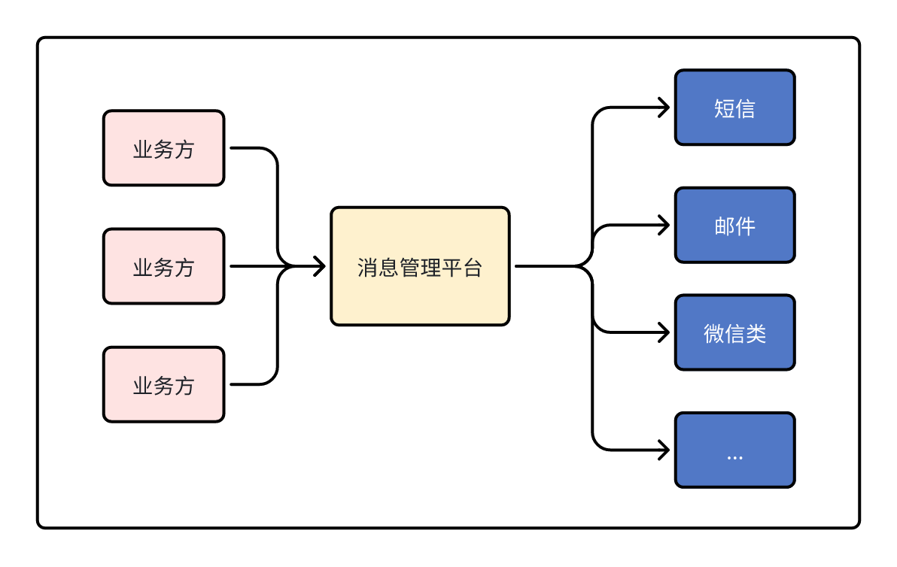
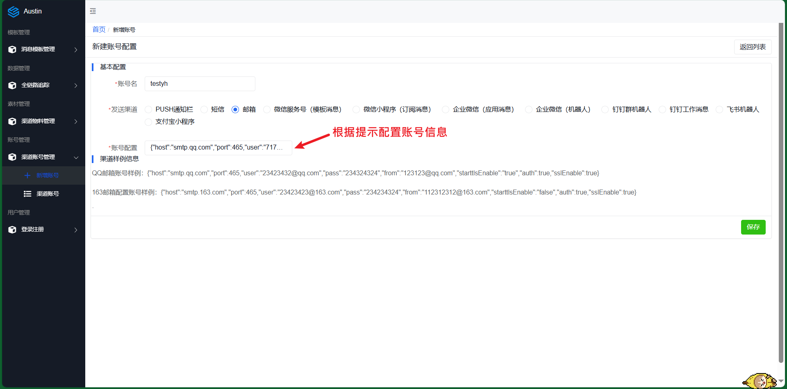
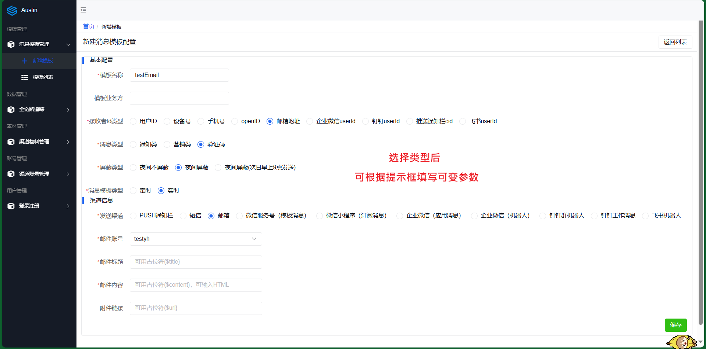
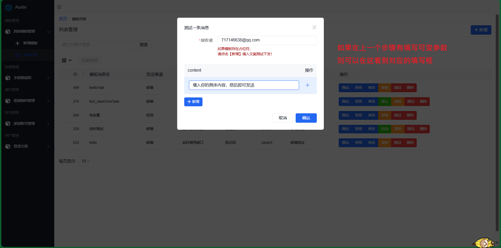

# Austin 文档

## 消息推送平台austin介绍

**核心功能**：统一的接口发送各种类型消息，对消息生命周期全链路追踪。

**意义**：只要公司内部有发送消息的需求，都应该要有类似`austin`的项目。消息推送平台对各类消息进行统一发送处理，这有利于对功能的收拢，以及提高业务需求开发的效率。

## 项目特征

**多渠道消息下发**：支持短信、邮件、微信服务号（模板消息）、微信小程序（订阅消息）、钉钉（群机器人）、钉钉（工作消息）、安卓push通知栏、企业微信(机器人消息)、企业微信（应用消息）、飞书机器人消息。

**渠道资源隔离**：不同的渠道不同的消息类型下发互不影响。例如邮件下发通道跟短信下发通道是隔离的，邮件发送缓慢不影响短信的正常发送。

**全渠道多维度消息链路追踪**：分别以用户、模板、消息的维度监控下发的过程，可准实时查看消息下发的情况。

**配置化人群定时消息下发**：上传人群文件，设置cron表达式定时下发消息。

**消息模板动态可变**：模板支持通过占位符，支持可变参数动态传入。

**高性能发送接口**：异步发送接口，支持批量发送，能支撑高并发流量。

**消息推送平台特性**：支持消息下发文案和频次去重，夜间消息屏蔽或次日发送。

**容器化部署**：项目支持docker部署，项目相关中间件用docker-compose一键部署。

## 使用操作

## 部署操作

austin项目**强依赖**`MySQL`/`Redis`/(**大概需要2G内存**)，**弱依赖**`kafka`/`prometheus`/`graylog`/`flink`/`xxl-job`/`apollo`(**完全部署所有的服务，大概16G内存**)。

**1**、austin目前使用的MySQL版本**5.7x**，如果你使用的MySQL版本8.0，注意改变`pom.xml`所依赖的版本以及对应的连接信息。

**2**、填写 application.properties 中`spring.datasource`对应的`ip/port/username/password`信息

**3**、执行`doc/sql`文件夹下的 austin.sql 创建对应的表

**4**、填写 application.properties 中`spring.redis`对应的`ip`/`port`/`password`信息

**5**、以上配置信息都在 application.properties 文件中修改。(`prometheus`/`graylog`/`flink`/`xxl-job`/`apollo`/`kafka`/`hive`可选)

**6**、正常使用**数据管理**(查看实时数据链路下发)需要将`austin-stream`的`jar`包上传至`Flink`，部署启动Flink。在打`jar`包前需要填写`com.javayh.austin.stream.constants.AustinFlinkConstant`中的`redis`和`kafka`的`ip/port`（注意：日志的topic在`application.properties`中的`austin.business.log.topic.name`。如果没有该topic，需要提前创建，并**使用Kafka**作为消息队列实现)

详细部署见 doc 目录下的 install.md

